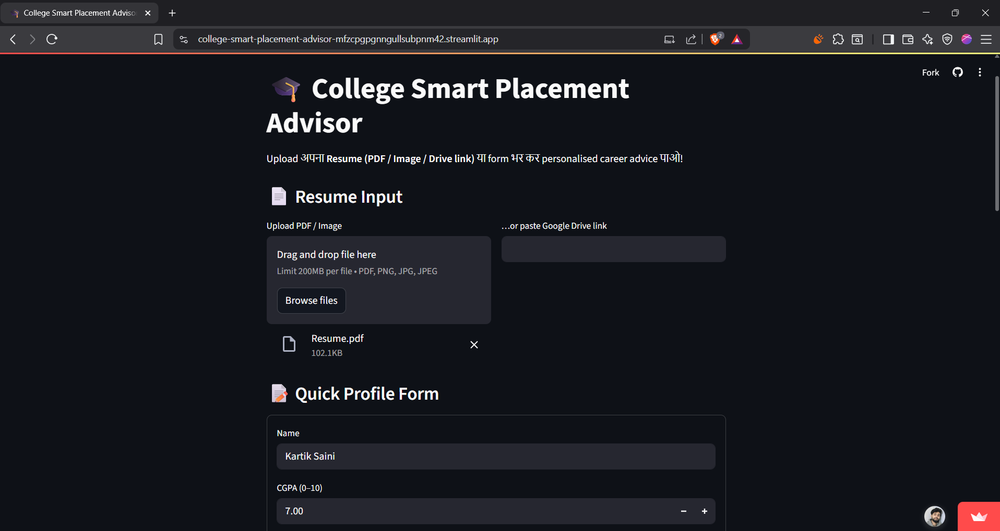
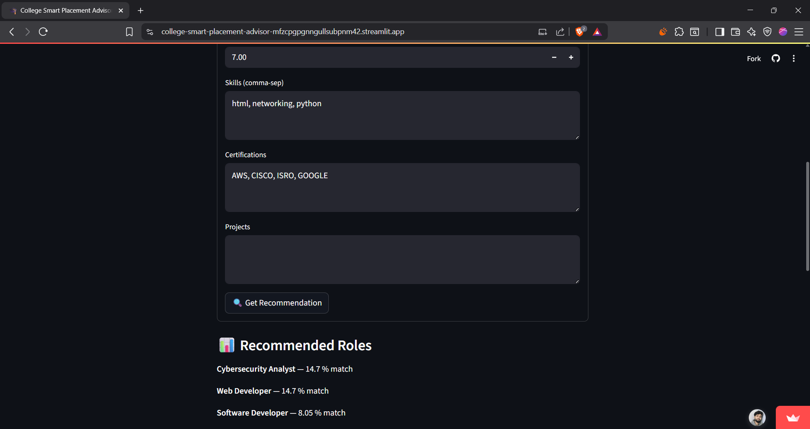
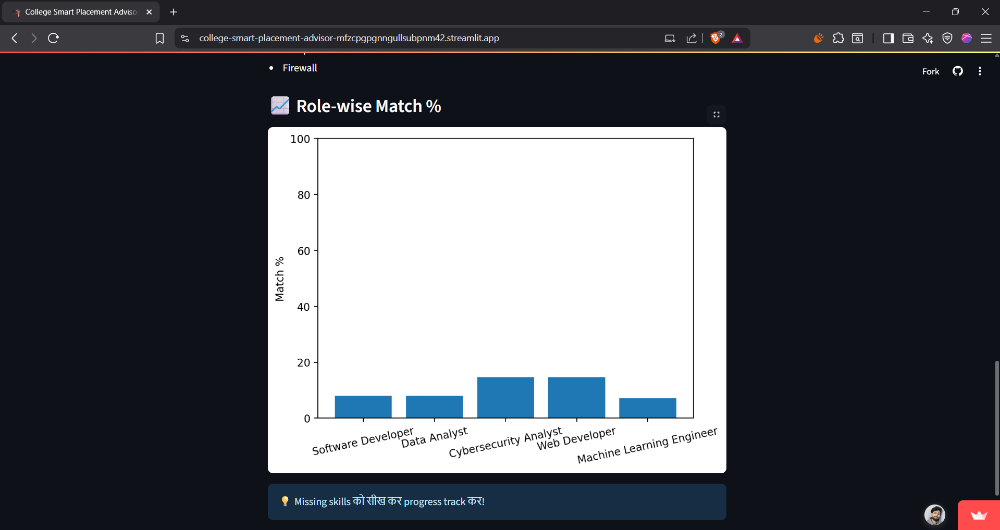
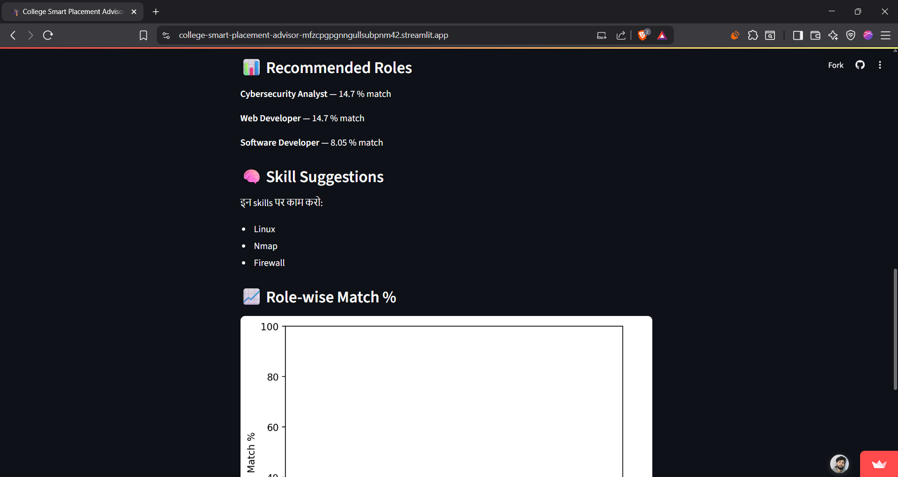

# 🎓 AI Placement Advisor

AI‑powered Streamlit app that analyzes your resume and gives you career role suggestions based on your skills, CGPA, and certifications — with skill-gap analysis!

---

## ✨ Features

- 📄 Upload resume as PDF, image, or Google Drive link  
- 🧠 Extracts Name, CGPA, Skills, Certifications automatically  
- 🔍 Matches profile with predefined job-role skill matrix (TF-IDF similarity)  
- 📊 Shows role-wise match % and missing skills to learn  
- 🎯 Built for students to understand and improve their placement readiness  

---

## 🚀 Quick Start

bash
git clone https://github.com/riya0701/AI-Placement-Advisor.git
cd ai-placement-advisor
pip install -r requirements.txt
streamlit run app.py

   

## 🛠 Tech Stack

| Layer           | Libraries / Tools                            |
|-----------------|----------------------------------------------|
| App Framework   | *Streamlit*                                |
| NLP & ML        | *scikit-learn* (TF-IDF, Cosine Similarity) |
| PDF Parsing     | *PyMuPDF*                                  |
| Image OCR       | *pytesseract*                              |
| Data Handling   | *pandas*                                   |
| Visualization   | *matplotlib*                               |

## 📸 Demo Screenshots

<table>
  <tr>
    <td>📝 Resume Upload + Profile Form</td>
    <td></td>
  </tr>
  <tr>
    <td>🧠 Job Recommendations</td>
    <td></td>
  </tr>
  <tr>
    <td>📊 Match % & Graph</td>
    <td></td>
  </tr>
  <tr>
    <td>🧩 Skill Suggestions</td>
    <td></td>
  </tr>
</table>

## 📌 Sample Job Roles (CSV)

csv
"Software Developer","python, java, git, oop"
"Data Analyst","python, sql, pandas, excel"
"ML Engineer","python, sklearn, numpy, pandas, ml"
"Cybersecurity Analyst","networking, linux, nmap, firewall"
"Web Developer","html, css, javascript, react"

## 📑 Future Enhancements

- *Admin Dashboard* for Training & Placement Cell to monitor aggregate skill gaps  
- *PDF Report Download* that attaches personalised recommendations to the student’s resume  
- *Learning Roadmap*: auto‑generated list of courses / YouTube playlists for missing skills  
- *Email Integration* to send results directly to students and T&P officers  
- *Role Templates Expansion*: add more job profiles such as DevOps Engineer, Cloud Architect, Product Manager  
- *Progress Tracker*: let users re‑upload updated resumes and visualise improvement over time  

---

## 🤝 Contributing

Pull requests are welcome! 🎯  
You can contribute by:

- Adding new job roles & skill mappings  
- Improving resume parsing logic  
- Enhancing UI/UX or fixing bugs  

To contribute:

1. Fork this repo  
2. Make your changes in a new branch  
3. Open a pull request 🚀

---

## 📬 Contact

Made with ❤ by *Riya Sharma*  
📧 Email: [sharmariya5808@gmail.com](mailto:sharmariya5808@gmail.com)  
🔗 LinkedIn: [https://www.linkedin.com/in/riya-sharma-770165271/](https://www.linkedin.com/in/riya-sharma-770165271/) 